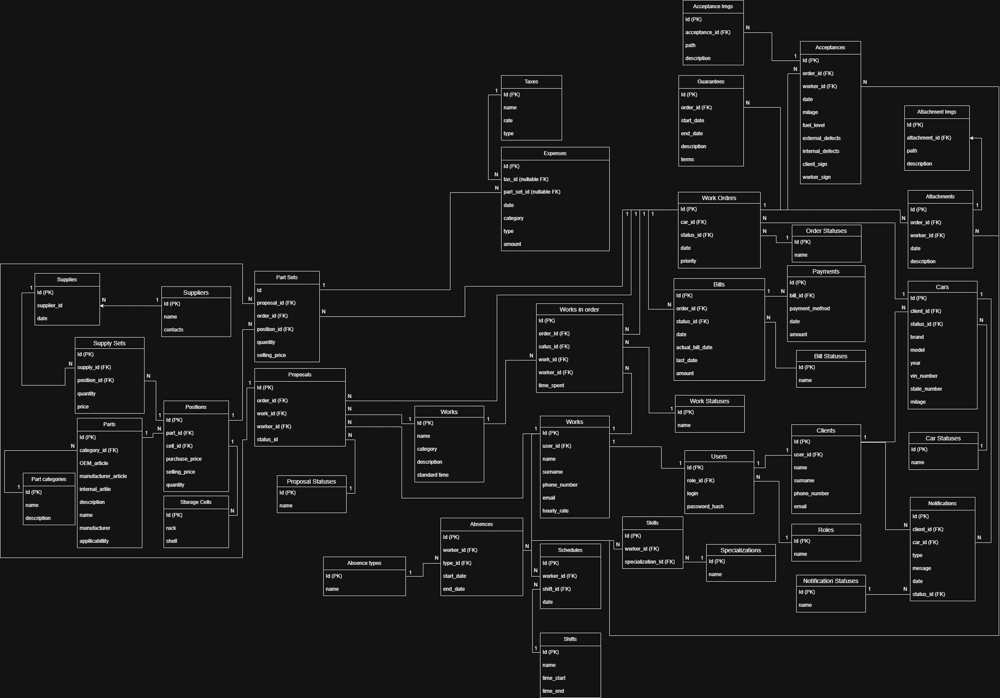

CRM system for AutoService

REST API for managing auto repair shop business processes: from customer registration to inventory management


---

Tech Stack:

*   **Framework:** ASP.NET Core 9 (C#)
*   **Database:** PostgreSQL + Entity Framework Core (Fluent API)
*   **Caching:** Redis (Distributed Cache)
*   **Object Storage:** MinIO (S3-compatible storage)
*   **Architecture:** Clean Architecture
*   **DevOps:** Docker & Docker Compose
*   **Other:** JWT Authentication (via secure Cookies), AutoMapper, Serilog, Npgsql.

---

Key Features:

- **Order Management:** Flexible lifecycle management for repair orders and statuses.
- **Inventory System:** Multi-layer warehouse accounting (Parts → Storage Cells → Supplies/Purchases).
- **Staff Scheduling:** Shift planning and absence tracking (sick leaves, vacations).
- **Automated Billing:** Real-time cost calculation based on standard labor hours and part prices.

---

Architecture & Design Highlights

The project is built with a focus on maintainability, scalability, and data integrity:

*   **Unit of Work & Transactions:** Ensures ACID properties for complex business processes involving multiple repositories (e.g., atomic creation of a User profile and a Worker record).
*   **Decorator Pattern:** Implements transparent caching via Redis. The core business logic remains "clean," while caching logic is injected via decorators at the DI level.
*   **S3 Storage Integration:** Vehicle defect images are stored in MinIO. Includes "compensating action" logic to clean up storage if a database write fails.
*   **Global Exception Handling:** Centralized Middleware to catch exceptions and return standardized JSON responses.
*   **Domain Validation:** Business rules and integrity checks are encapsulated directly within the Domain Models.

---

Project Structure:

*   **Core:** Domain models, Repository interfaces, Projection models (DTOs), Enums, and Custom Exceptions.
*   **Business:** Business logic implementation (Services), Service interfaces, and Caching decorators.
*   **DataAccess:** Repository implementations, Unit of Work, DB Context, and Fluent API configurations.
*   **API:** Controllers, Request/Response contracts, and AutoMapper profiles.

---

Database Schema:

<details>
  <summary>Click to expand the ER Diagram</summary>
  <br>
  <p align="center">
    
  </p>
</details>

Quick Start:
1. **Clone the repository:**
   ```bash
   git clone https://github.com/your-username/your-repo-name.git
2. **Starting the infrastructure (Postgres, Redis, MinIO):**
   ```bash
   docker-compose up -d 
3. **Starting the application:**
   ```bash
   dotnet run --project CRM_system_backend
4. Access API Documentation: Navigate to http://localhost:5066/swagger to test endpoints via Swagger UI.

